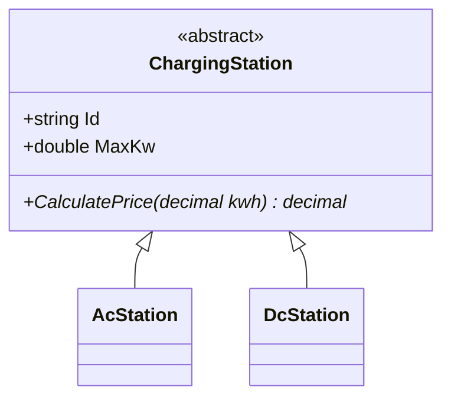

# ChargeHub.Pricing

```mermaid
classDiagram 
class ChargingStation {
    <<abstract>>
    +string Id
    +double MaxKw
    +CalculatePrice(decimal kwh) decimal*
}
ChargingStation <|-- AcStation
ChargingStation <|-- DcStation
```